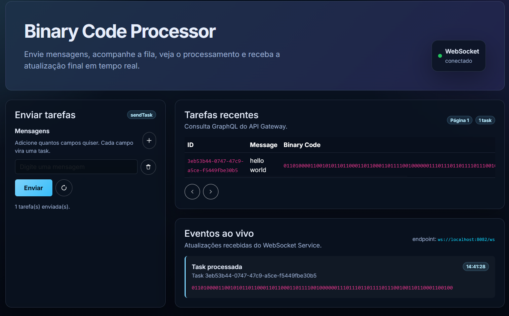
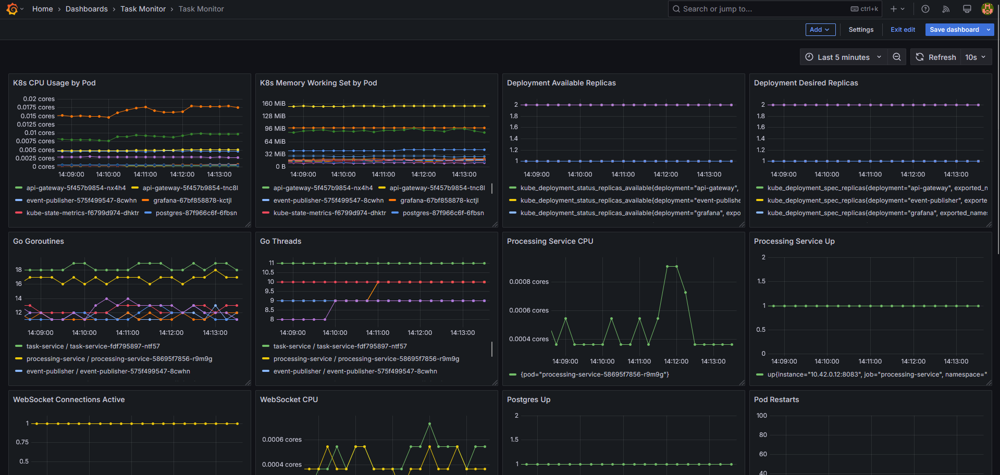
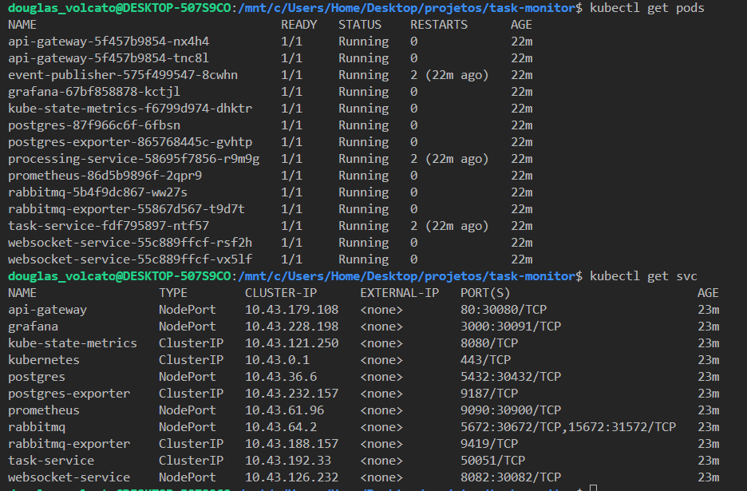
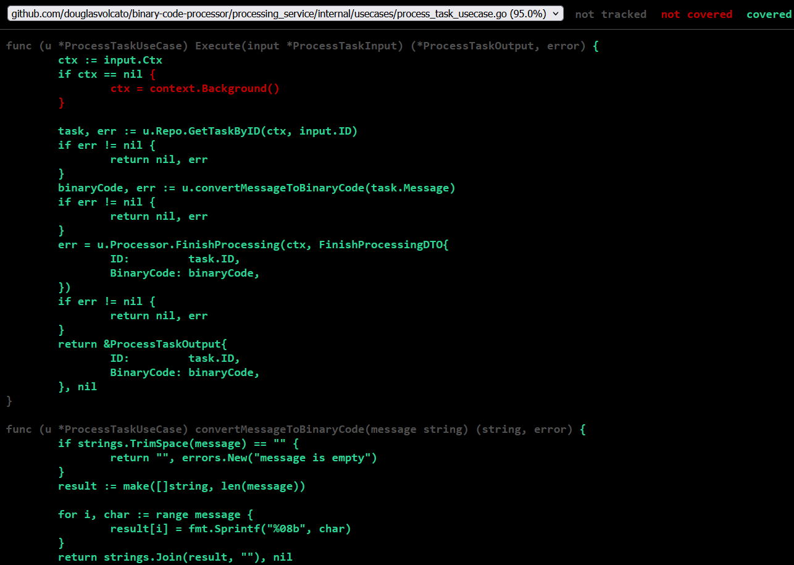

# binary-code-processor

Distributed system that processes messages and turns them into binary code. It was made using Golang, TDD, Clean Architecture and following scalability principles.

## Technologies
- Golang
- WebSocket (real-time updates)
- RabbitMQ (async queueing)
- GraphQL (API Gateway)
- gRPC (service-to-service)
- Postgres (persistent storage)
- Kubernetes (orchestration)

## Architecture
Below is the main architecture diagram showing the services and the message flow.


## Screenshots (gallery)
This repository includes a few screenshots captured from the demo environment to help visualise the system:

- **Client UI** — `docs/ui.png`
  
  _The client web UI used to submit messages, inspect recent tasks and see live WebSocket events._

- **Observability (Grafana)** — `docs/grafana.png`
  
  _Grafana dashboard showing service metrics (CPU, goroutines, request rates, etc.). Useful to verify deployment health._

- **Kubernetes / cluster view** — `docs/k8s.png`
  
  _A screenshot with `kubectl` output showing running pods and services used in the demo._

- **Test coverage snapshot** — `docs/test-coverage.png`
  
  _Coverage report snapshot used during development and CI checks._


## End-to-end Flow (summary)

The project implements a small distributed pipeline. High level flow:

1. Client sends `messages[]` to the API Gateway using GraphQL.
2. API Gateway streams messages to the Task Service (gRPC).
3. Task Service inserts tasks into Postgres and writes an unprocessed outbox event.
4. Event Publisher polls unprocessed events and publishes them to RabbitMQ (queue flow).
5. A processing worker consumes the queue, reads the task payload, converts the message to binary and streams the processed result back to the Task Service (gRPC callback).
6. Task Service marks the task as processed and writes a processed outbox event.
7. Event Publisher publishes processed events to a fanout exchange which the WebSocket Service consumes.
8. WebSocket Service pushes `Task{ID, BinaryCode}` to connected clients.

See the detailed section below for contracts and use cases.

## Contract shapes used in the flow

- `api_gateway/internal/entities.Task`: `ID`, `Message`, `BinaryCode`, `CreatedAt`, `UpdatedAt`
- `task_service/internal/entities.Task`: `ID`, `Message`, `BinaryCode`, `CreatedAt`, `UpdatedAt`
- `processing_service/internal/entities.Task`: `ID`, `BinaryCode`
- `websocket_service/internal/entities.Task`: `ID`, `BinaryCode`

## Data format notes

- Task IDs are opaque string identifiers generated by `IDGenerator`.
- `CreatedAt` and `UpdatedAt` are represented as strings at service boundaries in the codebase.
- If persisted in Postgres, timestamp fields should be mapped to `timestamp`/`timestamptz`.
- `BinaryCode` is empty before processing and set after `ProcessTaskUseCase` runs.

## Transport Map

- GraphQL: client ⇢ API Gateway
- gRPC: API Gateway ⇢ Task Service; Processing Service ⇢ Task Service (callback)
- Postgres: Task Service storage + outbox table
- RabbitMQ: Event Publisher → queue & fanout flows
- WebSocket: WebSocket Service → client

## End-to-end Flow Example

This is the detailed chain of usecases and transports the system implements.

### 1 - API Gateway
Use case: `SendTaskToProcessUseCase`

Input example:
```go
&SendTaskToProcessInput{ Messages: []string{"hello", "world"} }
```

Boundary method called: `TaskProcessorInterface.SendTaskToProcess(messages []string)`
Transport: `TaskService.ReceiveTaskToProcess(stream ReceiveTaskToProcessRequest)` (gRPC client-streaming)

### 2 - Task Service (create flow)
Use case: `ReceiveTaskToProcessUseCase` — inserts a task row and writes an unprocessed outbox event.

### 3 - Event Publisher
Use case: `ProcessUnprocessedEventsUseCase` — polls outbox, publishes queue messages (RabbitMQ)

### 4 - Processing Service
Use case: `ProcessTaskUseCase` — reads task by ID, converts `message` → `BinaryCode`, sends processed payload back via gRPC

### 5 - Task Service (processed flow)
Use case: `ReceiveProcessedTaskUseCase` — marks task as processed and writes processed outbox event

### 6 - Event Publisher (fanout)
Use case: `SendProcessedEventsUseCase` — publishes processed events to fanout exchange

### 7 - WebSocket Service
Use case: `SendProcessedTasksUseCase` — pushes `Task{ID, BinaryCode}` to clients

## Notes and next steps

- The repository contains generated gRPC stubs in each service; if you change proto files, regenerate the stubs.
- For a stronger contract, consider switching the processed-task stream to a structured message (e.g. `ProcessedTask { id, binary_code }`) instead of `repeated string`.
- Add DB migrations (DDL) for `tasks` and `outbox_events` if you plan to bootstrap a fresh environment.

## Author

Douglas Volcato — https://github.com/DouglasVolcato
