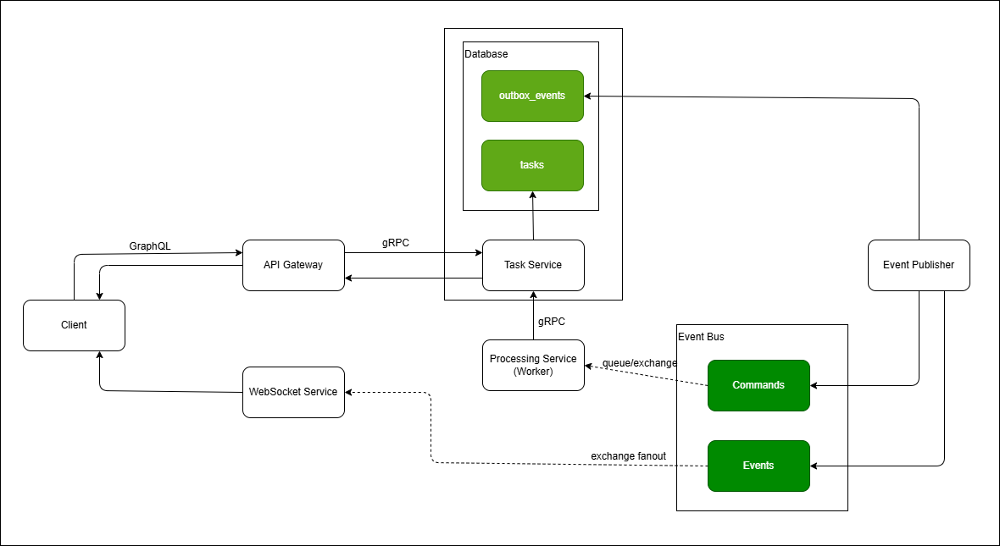

# binary-code-processer

Distributed sistem that processes messages and turns it into binary code. It was made using Golang, TDD, Clean Architecture and following scalability principles.

## Technologies:
- Golang: Code lannguage
- WebSocket: Used to get real time statuses
- RabbitMQ: Used to queue processes
- GraphQL: Used to simpify the api interaction
- gRPC: Used to simplify the microservices interaction
- Postgres: Database
- Kubernetes: Used to manage the containers and scale services

## Architecture:

### 1 - Client
- Fetches tasks from API Gateway (GraphQL)
- Sends tasks using GraphQL
- Connects to WebSocket Service for realtime updates

### 2 - API Gateway
- Receives client requests
- Validates input
- Forwards requests to Task Service via gRPC
- Does not persist domain data
- Does not handle WebSocket connections

### 3 - Task Service
- Owns the Postgres database (single source of truth)
- Creates and updates tasks
- Stores events in outbox table
- Publishes commands to RabbitMQ

### 4 - Processing Service (Worker)
- Consumes tasks from RabbitMQ
- Processes tasks asynchronously
- Updates task status via Task Service
- Generates events (via outbox)

### 5 - Event Publisher
- Reads events from outbox
- Publishes to RabbitMQ

### 6 - WebSocket Service
- Consumes events from RabbitMQ (fanout)
- Sends realtime updates to connected clients

## Author:
<a href="https://github.com/DouglasVolcato?tab=repositories">Douglas Volcato</a>
